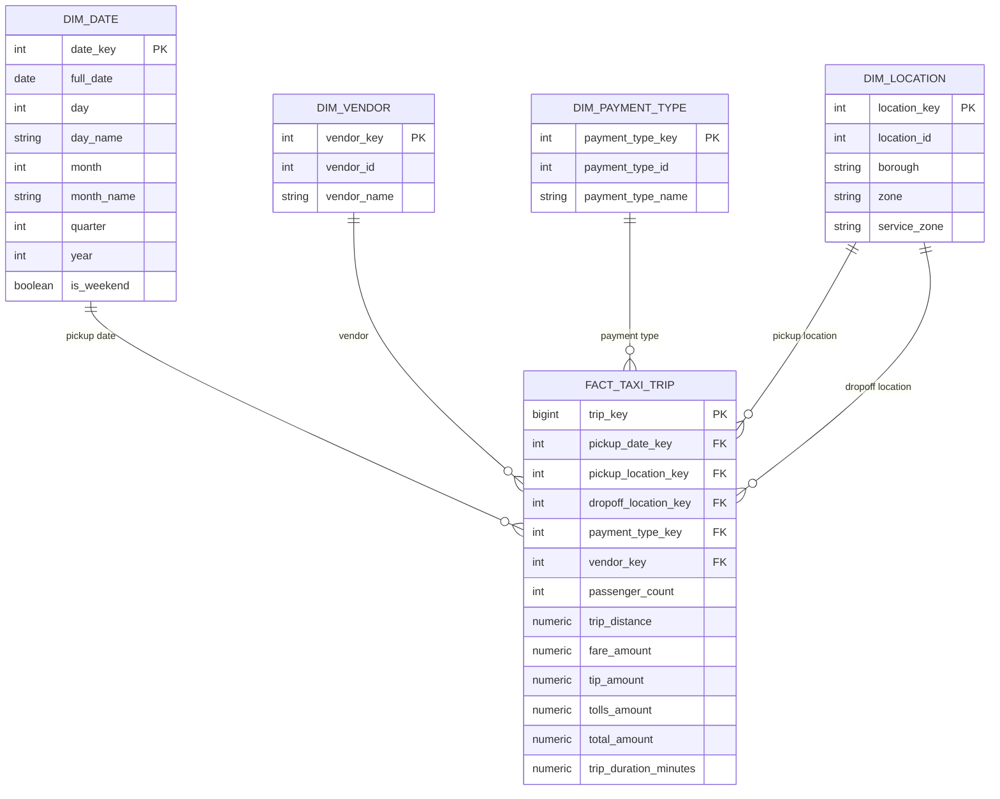

# NYC Taxi Dimensional Model — ERD

## Star Schema

**Grain:** One row in `fact_taxi_trip` represents one NYC taxi trip.



## Relationships

```text
dim_date.date_key
        ↓
fact_taxi_trip.pickup_date_key


dim_vendor.vendor_key
        ↓
fact_taxi_trip.vendor_key


dim_payment_type.payment_type_key
        ↓
fact_taxi_trip.payment_type_key


dim_location.location_key
        ↓
fact_taxi_trip.pickup_location_key


dim_location.location_key
        ↓
fact_taxi_trip.dropoff_location_key
```

## Role-Playing Dimension

`dim_location` performs two roles:

```text
Pickup Location
Dropoff Location
```

Therefore, separate physical pickup and dropoff dimension tables are not required.

During queries the dimension can be aliased:

```sql
JOIN dim_location pickup
    ON t.pu_location_id = pickup.location_id

JOIN dim_location dropoff
    ON t.do_location_id = dropoff.location_id
```

## Business Keys

Business/source keys include:

```text
location_id
vendor_id
payment_type_id
```

These originate from source data.

## Surrogate Keys

Warehouse-controlled surrogate keys include:

```text
location_key
vendor_key
payment_type_key
trip_key
```

Fact tables reference dimension surrogate keys.

## Measures

The fact table contains analytical measures:

```text
passenger_count
trip_distance
fare_amount
tip_amount
tolls_amount
total_amount
trip_duration_minutes
```

## Date Dimension

`dim_date` provides reusable calendar attributes:

```text
date_key
full_date
day
day_name
month
month_name
quarter
year
is_weekend
```

Date keys use:

```text
YYYYMMDD
```

## Data Quality Findings

Before loading the fact table, dimension coverage was validated.

A date check initially found:

```text
Total sample rows = 500000
Matched dates     = 499994
Unmatched dates   = 6
```

The six unmatched records belonged to:

```text
2025-12-31
```

The missing valid date was added to `dim_date`.

Final date validation:

```text
unmatched_dates = 0
```

The source also contained:

```text
payment_type = 0
```

This value was initially missing from `dim_payment_type`.

It was added as:

```text
0 = Flex Fare
```

This prevented valid source rows from being silently lost during the dimension joins.

## Design Summary

```text
                         dim_date
                            |
                            |
dim_vendor -------- fact_taxi_trip -------- dim_payment_type
                         /       \
                        /         \
                       /           \
          dim_location             dim_location
             pickup                  dropoff
```

This is a star schema with a role-playing location dimension.
