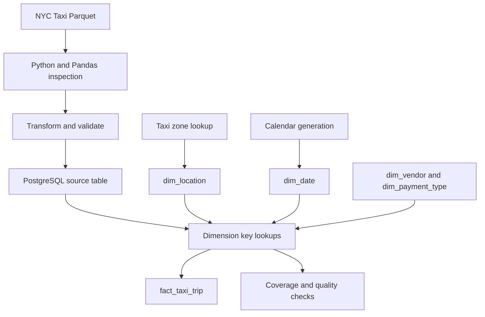

# Month 1 Internship Progress Report

**Data Engineering Internship | Weeks 1–4**

| Field | Details |
|---|---|
| Intern | Simran Thapa |
| Organization | Codavatar |
| Track | Data Engineering |
| Reporting period | Month 1 (Weeks 1–4) |
| Report prepared | 8 October 2026 |
| GitHub | [Sunflowers8/data-engineering](https://github.com/Sunflowers8/data-engineering) |

## 1. Executive Summary

During the first month of my Data Engineering internship, I progressed from foundational Python and SQL exercises to building modular data pipelines and designing a PostgreSQL dimensional warehouse. The focus was hands-on learning, debugging, data-quality validation, automated testing, and maintaining a documented GitHub portfolio.

The main practical dataset was **NYC Yellow Taxi trip data**, used for SQL analytics, Python ETL, and star-schema modeling.

## 2. Weekly Progress

| Week | Focus | Work completed |
|---|---|---|
| **1** | Foundations and setup | Python fundamentals, CSV transformations, PostgreSQL, DBeaver, Git/GitHub, basic SQL |
| **2** | SQL for analytics | Joins, CTEs, window functions, deduplication, sessionization, UPSERT, EXPLAIN/ANALYZE, indexing |
| **3** | Python data pipelines | Modular ETL, Pandas, SQLAlchemy, API extraction, retries, validation, logging, pytest and mocking |
| **4** | Dimensional modeling | Fact/dimension design, keys, grain, SCD concepts, NYC Taxi star schema, dimension loaders, data-quality checks and Mermaid ERD |

### Week 1 — Foundations and Setup

- Practiced Python variables, lists, dictionaries, loops, conditionals, functions, filtering and aggregation.
- Completed a CSV exercise that increased employee salaries by 10% and saved the updated data.
- Used VS Code, Git/GitHub, PostgreSQL and DBeaver.
- Practiced SQL `SELECT`, `WHERE`, `ORDER BY`, `GROUP BY`, aggregates and `HAVING`.

### Week 2 — SQL for Analytics

- Practiced joins, common table expressions (CTEs), subqueries, window functions, ranking, running totals, deduplication and sessionization.
- Studied PostgreSQL `ON CONFLICT` UPSERT and query plans with `EXPLAIN ANALYZE`.
- Loaded a **500,000-row NYC Taxi sample** into PostgreSQL.
- Tested an index on pickup location: one measured query improved from approximately **331 ms to 108 ms**. Also observed why a low-selectivity payment-type filter may favor a sequential scan.
- Explored date partitioning and partition pruning.

### Week 3 — Python Data Pipelines

- Built a modular ETL project with separate extraction, transformation, loading, database and configuration modules.
- Used Pandas and SQLAlchemy to process taxi data and load it into PostgreSQL.
- Built an API extraction component using `requests.Session`, timeouts, retry/backoff, HTTP error handling, Pydantic validation and logging.
- Created unit tests with `pytest` and mocking; **3 tests passed** during practice.
- Added pipeline notes, exercises and mini-project documentation to the repository.

**Week 3 artifacts:** [`03-week-python-pipelines/`](../03-week-python-pipelines/)

### Week 4 — Dimensional Modeling

- Designed a **star schema** centered on `fact_taxi_trip`, with `dim_date`, `dim_location`, `dim_vendor` and `dim_payment_type`.
- Defined fact grain: **one row represents one NYC taxi trip**.
- Distinguished business keys, surrogate keys, foreign keys, dimensions and analytical measures.
- Used `dim_location` as a **role-playing dimension** for both pickup and dropoff locations.
- Populated location and calendar dimensions and investigated unmatched dimension lookups.
- Added source payment type `0` (**Flex Fare**) to the payment dimension.
- Identified **six trips dated 2025-12-31** that were not covered by the January-only date dimension; added the missing date and verified zero unmatched dates.
- Added notes, exercises, a Mermaid ERD and mini-project documentation.

**Week 4 artifacts:** [`04-week-data-modeling/`](../04-week-data-modeling/) · [ERD](../04-week-data-modeling/erd/nyc-taxi-star-schema.md)

## 3. Major Practical Project — NYC Taxi Analytics

### Dataset and scope

| Item | Detail |
|---|---|
| Source | NYC Yellow Taxi trip data, January 2026 |
| Full source dataset | 3,724,889 rows, 20 original columns |
| Working PostgreSQL sample | 500,000 rows |
| Derived feature | `trip_duration_minutes` |
| Storage / processing | Parquet, Pandas, PostgreSQL |

### Workflow

### Data-quality observations

- Profiled missing values, duplicate records, zero-distance trips, negative fares and timestamp inconsistencies.
- Found **zero exact duplicates** in the full source dataset during inspection.
- Avoided automatically discarding unusual records without first understanding their business meaning.
- Checked dimension coverage before fact loading to avoid silently losing rows through `INNER JOIN` operations.

> **Verification note:** The 500,000-row fact load was performed during practice, but its final row count should be independently rechecked before formal submission.

## 4. Tools and Technical Skills

| Category | Tools / concepts |
|---|---|
| Programming | Python, functions, modules, type hints |
| Data processing | Pandas, CSV, JSON, Parquet |
| Databases | PostgreSQL, SQLAlchemy, DBeaver |
| SQL analytics | Joins, CTEs, window functions, indexes, execution plans |
| APIs | requests, retries, backoff, timeouts, Pydantic |
| Quality and testing | Logging, pytest, mocking, validation |
| Modeling | Star schema, fact/dimension tables, SCD Type 1/2, keys, grain |
| Development | VS Code, Git, GitHub; Docker/Colima environment configured |

## 5. Challenges and Resolutions

| Challenge | Action / lesson |
|---|---|
| Missing payment type in dimension | Added `payment_type=0` as Flex Fare to prevent unmatched joins. |
| Missing calendar date | Identified six trips on `2025-12-31`; extended `dim_date` and rechecked coverage. |
| Duplicate-load risk | Studied unique constraints, `NOT EXISTS` and UPSERT; stronger rerun safety remains future work. |
| Documentation gaps | Added Week 3/4 notes, exercises, Week 4 ERD and project README. |

## 6. Evidence and Deliverables

- **Repository:** [github.com/Sunflowers8/data-engineering](https://github.com/Sunflowers8/data-engineering)
- **Week 3:** Python ETL modules, API extraction component, unit tests, notes, exercises and mini-project README.
- **Week 4:** Star-schema SQL DDL, dimension-loading scripts, Mermaid ERD, notes, exercises and mini-project README.
- **Documentation commit:** [`06df4f8`](https://github.com/Sunflowers8/data-engineering/commit/06df4f8) — added six Week 3/4 portfolio documentation files.

## 7. Reflection

The most important lesson from Month 1 was that **a pipeline can run successfully and still lose valid data** if dimension joins do not cover every source record. Checking source-to-destination row counts, understanding business definitions, and validating data are as important as writing working code.

I also became more comfortable organizing projects into modules, testing behavior, reading SQL execution plans, and documenting implementation decisions.

## 8. Month 2 Learning Plan

| Week | Planned focus |
|---|---|
| **5** | Partitioned Parquet, object storage (S3/GCS conventions), cloud warehouse concepts, partitioning/clustering and cost |
| **6** | dbt staging, intermediate and mart models, tests, documentation and incremental materializations |
| **7** | Airflow DAGs, scheduling, dependencies, retries, failure diagnosis and backfills |
| **8** | Docker, CI/CD, automated data-quality checks and reproducible deployment |

## 9. Conclusion

Month 1 established practical foundations in SQL, Python ETL, testing and dimensional modeling. The next priority is to develop these local implementations into orchestrated, tested, warehouse-ready workflows, while improving idempotency and operational reliability.

---

**Prepared by:** Simran Thapa  
**Supervisor review / comments:** __________________________
